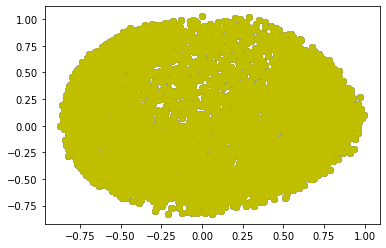
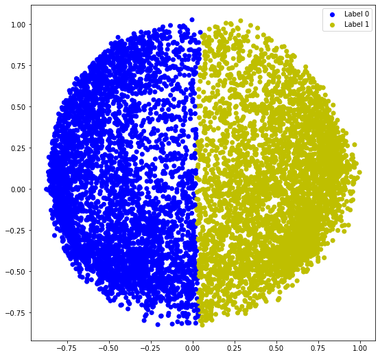
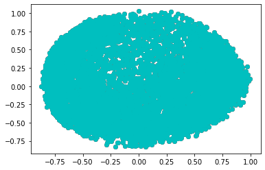
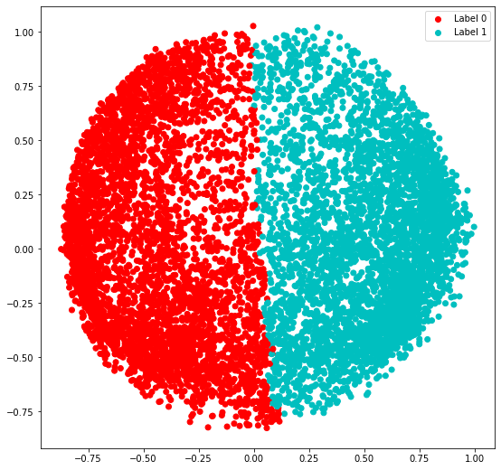
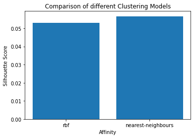

```python
import numpy as np
import pandas as pd
import matplotlib.pyplot as plt
```


```python
from sklearn.cluster import SpectralClustering
from sklearn.preprocessing import StandardScaler
from sklearn.preprocessing import normalize
from sklearn.decomposition import PCA
from sklearn.metrics import silhouette_score

```


```python
X=pd.read_csv("CC GENERAL.csv")
```


```python
X.head()
```


<div>
<style scoped>
    .dataframe tbody tr th:only-of-type {
        vertical-align: middle;
    }

    .dataframe tbody tr th {
        vertical-align: top;
    }

    .dataframe thead th {
        text-align: right;
    }
</style>
<table border="1" class="dataframe">
  <thead>
    <tr style="text-align: right;">
      <th></th>
      <th>CUST_ID</th>
      <th>BALANCE</th>
      <th>BALANCE_FREQUENCY</th>
      <th>PURCHASES</th>
      <th>ONEOFF_PURCHASES</th>
      <th>INSTALLMENTS_PURCHASES</th>
      <th>CASH_ADVANCE</th>
      <th>PURCHASES_FREQUENCY</th>
      <th>ONEOFF_PURCHASES_FREQUENCY</th>
      <th>PURCHASES_INSTALLMENTS_FREQUENCY</th>
      <th>CASH_ADVANCE_FREQUENCY</th>
      <th>CASH_ADVANCE_TRX</th>
      <th>PURCHASES_TRX</th>
      <th>CREDIT_LIMIT</th>
      <th>PAYMENTS</th>
      <th>MINIMUM_PAYMENTS</th>
      <th>PRC_FULL_PAYMENT</th>
      <th>TENURE</th>
    </tr>
  </thead>
  <tbody>
    <tr>
      <th>0</th>
      <td>C10001</td>
      <td>40.900749</td>
      <td>0.818182</td>
      <td>95.40</td>
      <td>0.00</td>
      <td>95.4</td>
      <td>0.000000</td>
      <td>0.166667</td>
      <td>0.000000</td>
      <td>0.083333</td>
      <td>0.000000</td>
      <td>0</td>
      <td>2</td>
      <td>1000.0</td>
      <td>201.802084</td>
      <td>139.509787</td>
      <td>0.000000</td>
      <td>12</td>
    </tr>
    <tr>
      <th>1</th>
      <td>C10002</td>
      <td>3202.467416</td>
      <td>0.909091</td>
      <td>0.00</td>
      <td>0.00</td>
      <td>0.0</td>
      <td>6442.945483</td>
      <td>0.000000</td>
      <td>0.000000</td>
      <td>0.000000</td>
      <td>0.250000</td>
      <td>4</td>
      <td>0</td>
      <td>7000.0</td>
      <td>4103.032597</td>
      <td>1072.340217</td>
      <td>0.222222</td>
      <td>12</td>
    </tr>
    <tr>
      <th>2</th>
      <td>C10003</td>
      <td>2495.148862</td>
      <td>1.000000</td>
      <td>773.17</td>
      <td>773.17</td>
      <td>0.0</td>
      <td>0.000000</td>
      <td>1.000000</td>
      <td>1.000000</td>
      <td>0.000000</td>
      <td>0.000000</td>
      <td>0</td>
      <td>12</td>
      <td>7500.0</td>
      <td>622.066742</td>
      <td>627.284787</td>
      <td>0.000000</td>
      <td>12</td>
    </tr>
    <tr>
      <th>3</th>
      <td>C10004</td>
      <td>1666.670542</td>
      <td>0.636364</td>
      <td>1499.00</td>
      <td>1499.00</td>
      <td>0.0</td>
      <td>205.788017</td>
      <td>0.083333</td>
      <td>0.083333</td>
      <td>0.000000</td>
      <td>0.083333</td>
      <td>1</td>
      <td>1</td>
      <td>7500.0</td>
      <td>0.000000</td>
      <td>NaN</td>
      <td>0.000000</td>
      <td>12</td>
    </tr>
    <tr>
      <th>4</th>
      <td>C10005</td>
      <td>817.714335</td>
      <td>1.000000</td>
      <td>16.00</td>
      <td>16.00</td>
      <td>0.0</td>
      <td>0.000000</td>
      <td>0.083333</td>
      <td>0.083333</td>
      <td>0.000000</td>
      <td>0.000000</td>
      <td>0</td>
      <td>1</td>
      <td>1200.0</td>
      <td>678.334763</td>
      <td>244.791237</td>
      <td>0.000000</td>
      <td>12</td>
    </tr>
  </tbody>
</table>
</div>


```python
X=X.drop('CUST_ID',axis=1)

```


```python
X.fillna(method='ffill',inplace=True)
```


```python
print(X.head())
```

           BALANCE  BALANCE_FREQUENCY  PURCHASES  ONEOFF_PURCHASES  \
    0    40.900749           0.818182      95.40              0.00   
    1  3202.467416           0.909091       0.00              0.00   
    2  2495.148862           1.000000     773.17            773.17   
    3  1666.670542           0.636364    1499.00           1499.00   
    4   817.714335           1.000000      16.00             16.00   
    
       INSTALLMENTS_PURCHASES  CASH_ADVANCE  PURCHASES_FREQUENCY  \
    0                    95.4      0.000000             0.166667   
    1                     0.0   6442.945483             0.000000   
    2                     0.0      0.000000             1.000000   
    3                     0.0    205.788017             0.083333   
    4                     0.0      0.000000             0.083333   
    
       ONEOFF_PURCHASES_FREQUENCY  PURCHASES_INSTALLMENTS_FREQUENCY  \
    0                    0.000000                          0.083333   
    1                    0.000000                          0.000000   
    2                    1.000000                          0.000000   
    3                    0.083333                          0.000000   
    4                    0.083333                          0.000000   
    
       CASH_ADVANCE_FREQUENCY  CASH_ADVANCE_TRX  PURCHASES_TRX  CREDIT_LIMIT  \
    0                0.000000                 0              2        1000.0   
    1                0.250000                 4              0        7000.0   
    2                0.000000                 0             12        7500.0   
    3                0.083333                 1              1        7500.0   
    4                0.000000                 0              1        1200.0   
    
          PAYMENTS  MINIMUM_PAYMENTS  PRC_FULL_PAYMENT  TENURE  
    0   201.802084        139.509787          0.000000      12  
    1  4103.032597       1072.340217          0.222222      12  
    2   622.066742        627.284787          0.000000      12  
    3     0.000000        627.284787          0.000000      12  
    4   678.334763        244.791237          0.000000      12  
    


```python
#preprocessing the data
scaler=StandardScaler()
X_scaled=scaler.fit_transform(X)
#normalizing the data so that the data approximately follows gaussian distribution
X_normalized=normalize(X_scaled)
#converting numpy array to pandas
X_normalized=pd.DataFrame(X_normalized)
```


```python
pca=PCA(n_components=2)
X_principal=pca.fit_transform(X_normalized)
X_principal=pd.DataFrame(X_principal)
X_principal.columns=['P1','P2']
print(X_principal.head())
```

             P1        P2
    0 -0.489949 -0.679977
    1 -0.519099  0.544826
    2  0.330633  0.268880
    3 -0.481656 -0.097611
    4 -0.563512 -0.482506
    


```python
#affinity='rbf'
spectral_model_rbf=SpectralClustering(n_clusters=2,affinity='rbf')
labels_rbf=spectral_model_rbf.fit_predict(X_principal)
```


```python
colours = {}
colours[0] = 'b'
colours[1] = 'y'
  
# Building the colour vector for each data point
cvec = [colours[label] for label in labels_rbf]
  
# Plotting the clustered scatter plot
  
b = plt.scatter(X_principal['P1'], X_principal['P2'], color ='b');
y = plt.scatter(X_principal['P1'], X_principal['P2'], color ='y');
  
plt.figure(figsize =(9, 9))
plt.scatter(X_principal['P1'], X_principal['P2'], c = cvec)
plt.legend((b, y), ('Label 0', 'Label 1'))
plt.show()
```








```python
# Building the clustering model
spectral_model_nn = SpectralClustering(n_clusters = 2, affinity ='nearest_neighbors')
  
# Training the model and Storing the predicted cluster labels
labels_nn = spectral_model_nn.fit_predict(X_principal)
```


```python
colours = {}
colours[0] = 'r'
colours[1] = 'c'
  
# Building the colour vector for each data point
cvec1 = [colours[label] for label in labels_nn]
  
# Plotting the clustered scatter plot
  
r = plt.scatter(X_principal['P1'], X_principal['P2'], color ='r');
c = plt.scatter(X_principal['P1'], X_principal['P2'], color ='c');
  
plt.figure(figsize =(9, 9))
plt.scatter(X_principal['P1'], X_principal['P2'], c = cvec1)
plt.legend((r, c), ('Label 0', 'Label 1'))
plt.show()
```








```python
#evaluating the performances
affinity = ['rbf', 'nearest-neighbours']
  
# List of Silhouette Scores
s_scores = []
  
# Evaluating the performance
s_scores.append(silhouette_score(X, labels_rbf))
s_scores.append(silhouette_score(X, labels_nn))
  
print(s_scores)
```

    [0.05300611480757429, 0.05667039590382262]
    


```python
#comapring the performances
plt.bar(affinity, s_scores)
plt.xlabel('Affinity')
plt.ylabel('Silhouette Score')
plt.title('Comparison of different Clustering Models')
plt.show()
```





```python

```
